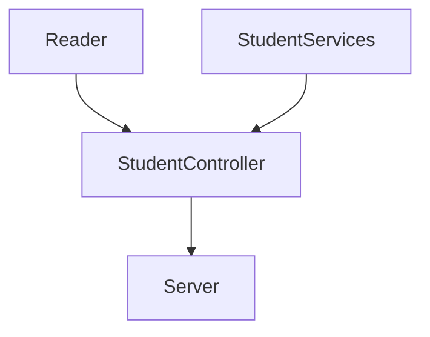

# Code Challenge - Microsoft

## Requerimientos 

* Habilitar un endpoint para consultar todos los estudiantes con todos sus campos.
* Habilitar un endpoint para consultar los emails de todos los estudiantes que tengan certificación haveCertification.
* Habilitar un endpoint para consultar todos los estudiantes que tengan credits mayor a 500.

## Diseño de componentes

<br>


### Reader

Se encarga de leer el archivo 'visualpartners.json' para convertirlo en datos modificables.

```js
const fs = require("fs");

class Reader {
    static readJsonFile(path) {
        const rawdata = fs.readFileSync(path);
        return JSON.parse(rawdata);
    }
}

module.exports = Reader;
```

### StudentServices

Tiene los metodos para analizar los estudiantes y regresarlos.

```js
class studentServices {
    static studentFullFields(students) {
        return students;
    }

    static studentCertificationField(students) {
        return students
            .filter((student) => {
                return student.haveCertification === true;
            })
            .map((student) => {
                return student.email;
            });
    }

    static studentCredits(students) {
        return students.filter((student) => {
            return student.credits > 500;
        });
    }
}

module.exports = studentServices;
```

### StudentsController

Se encarga de juntar services y reader, conectando con el server.

```js
const Reader = require("./../utils/Reader");
const StudentServices = require("./../services/StudentServices");

class StudentController {
    static studentFullFields() {
        const data = Reader.readJsonFile("data/visualpartners.json");
        return StudentServices.studentFullFields(data);
    }

    static studentCertificationField() {
        const data = Reader.readJsonFile("data/visualpartners.json");
        return StudentServices.studentCertificationField(data);
    }

    static studentCredits() {
        const data = Reader.readJsonFile("data/visualpartners.json");
        return StudentServices.studentCredits(data);
    }
}

module.exports = StudentController;
```

### Node Server Endpoints

Inicializa el servidor y escucha peticiones.

``` js
app.get("/", (req, res) => {
    res.status(200).send("Welcome");
});

app.get("/v1/students", (req, res) => {
    res.status(200).send(StudentController.studentFullFields());
});

app.get("/students/emails", (req, res) => {
    res.status(200).send(StudentController.studentCertificationField());
});

app.get("/students/credits", (req, res) => {
    res.status(200).send(StudentController.studentCredits());
});

});
```
<br>

## Documentación postman

Documentación de los endpoints con ejemplos

[Postman Documentation Link](https://documenter.getpostman.com/view/20932670/UyxhonQX)
<br>
## Dependencias usadas

* Jest
* Express
* Linter
